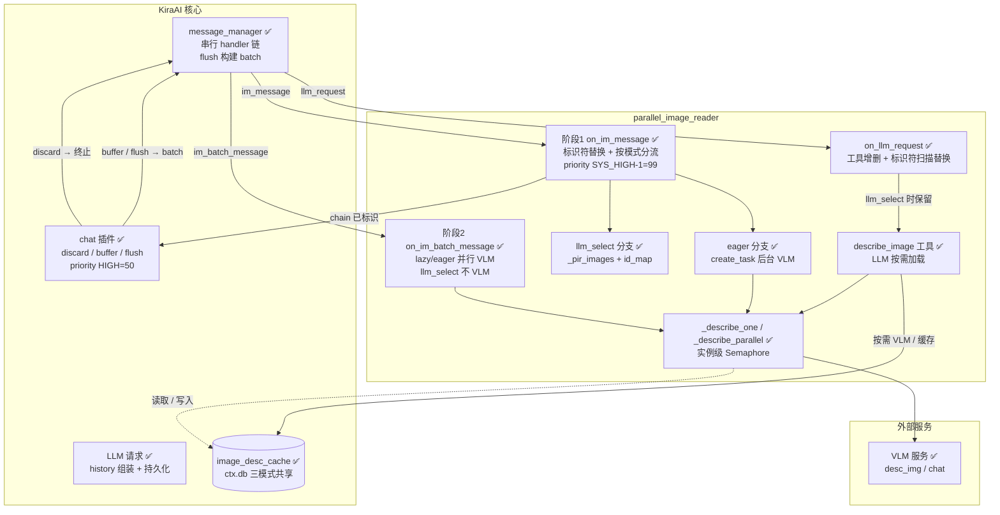
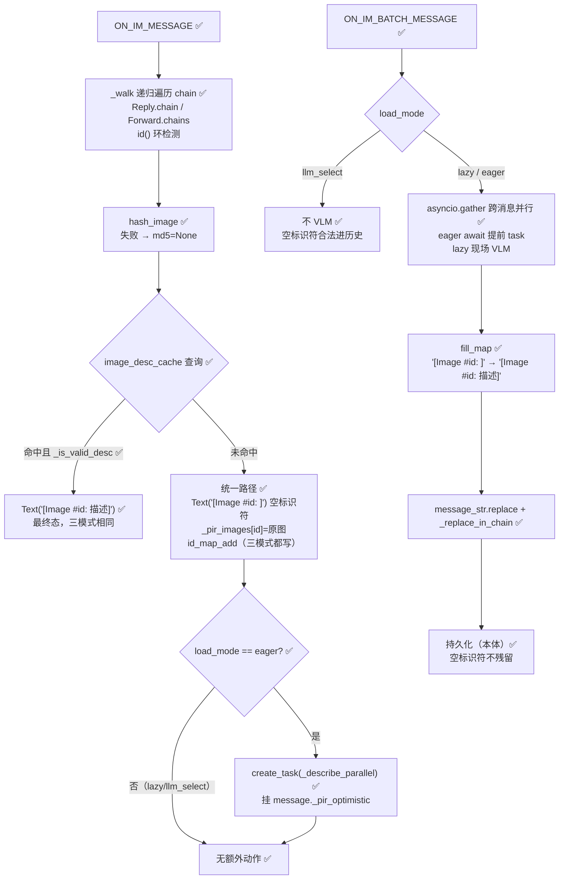
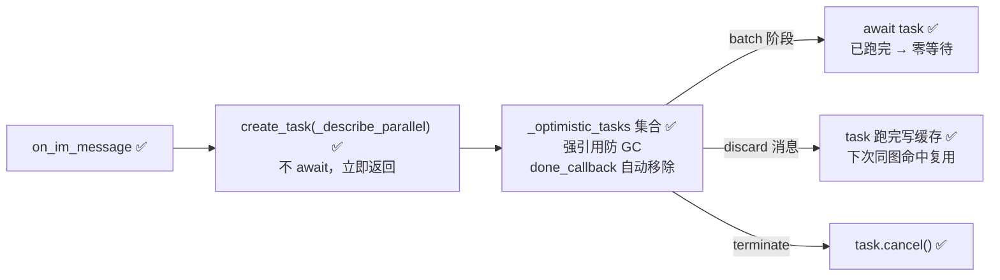
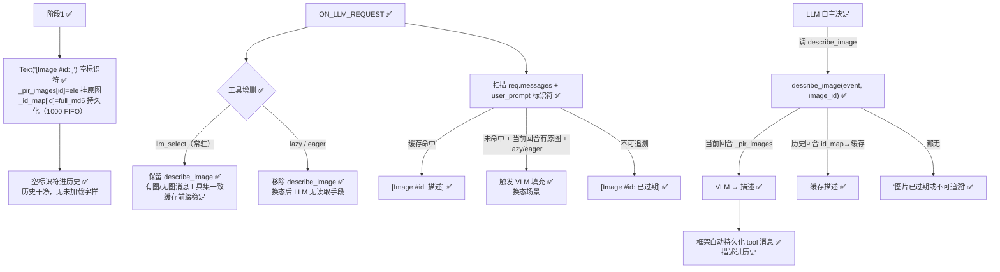
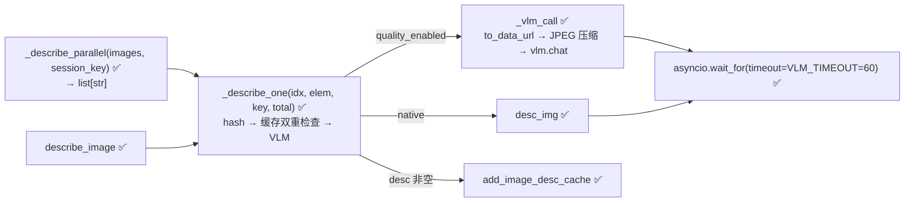

# parallel_image_reader 架构设计

> 最后更新：2026-08-04
> 接口契约权威：KiraAI 核心（`core/message_manager.py`、`core/plugin/`、`core/chat/message_utils.py`）。测试策略见 `test_v2.py`（stub 隔离，零网络/DB 依赖）。
> 📐 文档约束：mermaid 是完整设计，节点用状态标记说明实现状态。章节标题不写状态标记。文本陈述当前状态，不写 changelog 式措辞。存储/队列只记接口签名和装配关系，不展开设计细节。

- [一、系统全貌](#一系统全貌)
- [二、消息管线接入](#二消息管线接入)
  - [2.1 事件钩子](#21-事件钩子)
  - [2.2 完整决策树](#22-完整决策树)
  - [2.3 三模式处理流程](#23-三模式处理流程)
  - [2.4 乐观加载（eager）](#24-乐观加载eager)
  - [2.5 LLM 选择性加载（llm_select）](#25-llm-选择性加载llm_select)
- [三、核心数据结构](#三核心数据结构)
- [四、VLM 调用与缓存](#四vlm-调用与缓存)
- [五、并发控制](#五并发控制)
- [六、故障与边界](#六故障与边界)
- [七、配置项](#七配置项)
- [八、测试](#八测试)

**状态标记**：
| 标记 | 含义 |
|------|------|
| ✅ | 已实现 |
| ❌ | 意向设计，待实现 |
| 🔄 | 存在但待变更（当前实现将被替换） |
| ⚠️ | 代码存在但条件不具备（如等待后端） |

---

## 一、系统全貌



### 部署形态

KiraAI 插件，作为 `data/plugins/parallel_image_reader` 目录加载（symlink 指向仓库）。进程内运行，无独立进程、无外部依赖。被 KiraAI `plugin_manager` 在启动时 `initialize()`，退出时 `terminate()`。

### 与 KiraAI 核心的协作

- **消息链**（`message.chain`）：`MessageChain` 包装类，元素为 `Text` / `Image` / `Sticker` / `Reply` / `Forward` 等。插件遍历并**原地替换**其中的图片元素。
- **消息命运**：chat 插件在 `ON_IM_MESSAGE`（priority 50）决定 `discard` / `buffer` / `flush`；`flush` 时 `message_manager` 将同 session 的 message 聚合成 batch 派发 `ON_IM_BATCH_MESSAGE`，**batch 中的 message 与 IM 阶段是同一实例**（属性得以跨阶段传递）。
- **持久化**：`message_str` 在 batch 阶段生成 → `ON_IM_BATCH_MESSAGE` 修正 → 入 prompt → 持久化。插件在持久化**之前**完成标识符替换。
- **工具系统**：`register.tool(name, desc, params_json_schema)` 注册工具；`llm_client.execute_tool(event, resp)` 执行（工具拿到 batch event）；工具结果作为 tool 消息**自动持久化**进历史（agent_executor 行为）。

---

## 二、消息管线接入

### 2.1 事件钩子

| 事件 | 优先级 | 时机 | 职责 |
|------|--------|------|------|
| `ON_IM_MESSAGE` | `SYS_HIGH - 1` = 99 | 早于 chat 插件(50) | 标识符替换 + 按模式分流 + 缓存命中直接填充 |
| `ON_IM_BATCH_MESSAGE` | `SYS_HIGH - 1` = 99 | 本体 `message_format_to_text` 之后 | lazy/eager 并行 VLM + 标识符替换；llm_select 不 VLM |
| `ON_LLM_REQUEST` | `SYS_HIGH - 1` = 99 | LLM 请求组装时 | 换态工具增删 + 历史标识符扫描替换 + hint 注入 |

### 2.2 完整决策树

代码行为的总入口，四个决策点按消息生命周期排列。每个分支标注触发条件与结果。

```
━━━ 决策点 1：阶段1（ON_IM_MESSAGE）— 每条消息到达时（三模式统一）━━━

对 chain 中每个 Image/Sticker 元素：
│
├─ hash_image() 成功？ ── 否 ──→ md5=None，跳过缓存查询
│
├─ image_desc_cache 查询（md5）命中 + _is_valid_desc？ ── 是 ──→ Text("[Image #id: 描述]")，零 VLM
│                                                              （最终态，三模式相同）
│
└─ 未命中 → 统一路径（三模式无分支）：
    ├─ 生成 short_id（md5 前 8 位 / noid_ 前缀，碰撞防御加长）
    ├─ id_map_add(short_id, full_md5)     ← 三模式都写（换态反查）
    ├─ Text("[Image #id: ]") 空标识符      ← 统一待填充态
    └─ _pir_images[short_id] = 原图        ← 唯一暂存机制

处理完所有元素：
├─ load_mode == eager 且 _pir_images 非空 → create_task(_describe_parallel) 挂 _pir_optimistic
├─ lazy / llm_select → 无额外动作
└─ id_map 落盘（新标识符已写入内存映射）


━━━ 决策点 2：阶段2（ON_IM_BATCH_MESSAGE）— 消息确认发给 LLM 后（统一填充）━━━

│
├─ 遍历 event.messages：
│   ├─ _pir_images 空 → 跳过（无图/全缓存命中）
│   ├─ load_mode == llm_select → 跳过（空标识符合法进历史，最终态）
│   └─ 否则（lazy/eager）→ 加入 groups：
│       ├─ 有 _pir_optimistic（eager 提前启动）→ groups.append((msg, images_map, task))
│       └─ 无（lazy 现场）→ groups.append((msg, images_map, _describe_parallel(...)))
│
└─ groups 非空 → asyncio.gather 跨消息并行执行所有 VLM 任务
    （lazy 多消息也并行；eager task 已跑完则零等待）
    → 逐消息填充 fill_map: "[Image #id: ]" → "[Image #id: 描述|(description unavailable)]"
    → 替换 message_str + chain（_replace_in_chain 精确替换）
    → 持久化（空标识符不残留）
    （异常/Ctrl+C → 空标识符残留为合法状态，直接重抛，无需清理）


━━━ 决策点 3：ON_LLM_REQUEST — LLM 请求组装时 ━━━

│
├─ 工具增删（换态）：
│   ├─ load_mode != llm_select → req.tool_set.remove("describe_image")
│   └─ llm_select → describe_image 常驻（有图/无图消息工具集一致，
│                    工具前缀稳定 → LLM 上下文缓存命中不受影响）
│
├─ 扫描 req.messages（历史）+ req.user_prompt（当前）中所有 [Image #id: ...]：
│   │
│   ├─ 内容非空（已有描述/已过期）→ 跳过
│   │
│   ├─ 空内容 → id_map 反查 full_md5 → 查 image_desc_cache：
│   │   ├─ 缓存命中 → 替换为 [Image #id: 描述]
│   │   ├─ 未命中 + 当前回合 _pir_images 有原图 + 非 llm_select → 触发 VLM 填充
│   │   │   └─ VLM 成功 → [Image #id: 描述]；失败 → [Image #id: 已过期]
│   │   └─ 未命中 + 不可追溯（无原图/无 id_map）→ [Image #id: 已过期]
│   │
│   └─ 注：llm_select 下当前回合未命中 → 保持空（LLM 可用工具自行加载）
│
└─ 注入 system hint（按 load_mode 说明 [Image #id: ...] 格式 / describe_image 用法）


━━━ 决策点 4：describe_image 工具（仅 llm_select 模式被 LLM 调用）━━━

LLM 调 describe_image(image_id)：
│
├─ 当前回合：遍历 event.messages 的 _pir_images 找原图元素？
│   ├─ 命中 → hash → 缓存？→ 描述 : VLM → 返回描述（并写缓存）
│   └─ 未命中 → 下查
│
├─ 历史回合：_id_map[image_id] → full_md5 → 查 image_desc_cache？
│   ├─ 命中 → 返回缓存描述
│   └─ 未命中 → 下查
│
└─ 都无 → 返回 "图片已过期或不可追溯"
    （工具结果由框架自动持久化为 tool 消息进历史）
```

### 2.3 三模式处理流程



### 2.4 乐观加载（eager）

`load_mode=eager` 时，阶段1收到图片即启动后台 VLM task：



### 2.5 LLM 选择性加载（llm_select）

不预调 VLM，图片替换为**空描述标识符** `[Image #id: ]` 进历史，LLM 通过 `describe_image` 工具按需加载：



**设计权衡**：
- **描述进历史**：工具结果由 agent_executor 自动持久化为 tool 消息（零额外代码）；user 消息保持空标识符（短、干净）
- **换态**：ON_LLM_REQUEST 扫描历史标识符 → 查共享缓存替换。三模式共用 `image_desc_cache`，换态无缝
- **历史文件不写回**：扫描替换只影响 LLM 输入，chat_memory.json 保持空标识符（避免时序竞争）
- **工具常驻保缓存**：describe_image 在 llm_select 下常驻（不因当前消息有无图而移除）——LLM 上下文缓存按请求前缀精确匹配（OpenAI 明确 tools 参与；DeepSeek 同前缀原则），有图/无图消息交替时工具集抖动会让缓存整轮 miss。常驻代价：lazy/eager 下 LLM 可见该工具，但 hint 不指导调用、标识符均带内容，乱调被工具内部兜底（零 VLM，最多浪费一个 agent step）

---

## 三、核心数据结构

### 标识符格式（三模式统一）

| 项 | 值 |
|----|----|
| 格式 | `[Image #<short_id>: <内容>]`（**唯一形态**，三模式统一） |
| short_id | md5 前 8 位（碰撞防御逐位加长，`_make_image_id`） |
| 内容区 | 空（待填充）/ 描述 / 已过期（三态） |
| 匹配正则 | `_IMAGE_RE = r"\[Image #([^\]\s:]+): [^\]]*\]"` |

### 消息对象自定义属性

| 属性 | 阶段 | 内容 |
|------|------|------|
| `message._pir_images` | IM → batch | `{short_id: ele}` **唯一暂存机制**（三模式共用） |
| `message._pir_optimistic` | IM → batch | `asyncio.Task`，仅 eager 模式挂载 |

### 插件实例状态

| 字段 | 说明 |
|------|------|
| `self._optimistic_tasks: set` | eager in-flight task 强引用池 |
| `self._sem: asyncio.Semaphore` | 实例级全局并发信号量 |
| `self._id_map: dict[str, str]` | short_id → full_md5 映射（三模式都写，历史反查） |
| `self.load_mode: str` | lazy / eager / llm_select |
| `self.id_map_limit: int` | id_map 上限（默认 1000，FIFO 淘汰） |

### id_map 持久化

- 位置：`plugin_data/parallel_image_reader/id_map.json`
- 结构：`{short_id: full_md5}`，JSON
- 上限：`id_map_limit`（默认 1000），超限淘汰最早写入（dict 插入序）
- 时机：三模式阶段1 新增时写盘；terminate 兜底保存

### 缓存校验 `_is_valid_desc(desc)`

拒绝四类缓存描述：空串、含 `\x00`（旧 caption 方案遗留污染）、含 `<!--PIR:`（旧占位符自我污染，历史防御）、含 `[Image #`（标识符格式嵌套污染，注入防御）。阶段1 与阶段2 双重检查。

---

## 四、VLM 调用与缓存

### 接口签名（`ctx.db`）

```python
async def get_image_desc_cache(md5: str) -> dict | None   # {"description": str, "count": int}
async def add_image_desc_cache(md5, desc, count=1, last_seen=0) -> None
```

缓存由 KiraAI 统一管理（15/30 天过期清理），三模式共享同一缓存库。**无遍历/前缀查询接口** → 历史反查必须走 id_map。

### 调用路径



- **单图失败**：`_describe_one` 内 `try/except` 返回 `""` → 降级为 `"(description unavailable)"`
- **任务级失败**：`gather(return_exceptions=True)` 过滤
- **VLM 未配置**：异常被 `_describe_one` 捕获降级

---

## 五、并发控制

| 机制 | 位置 | 说明 |
|------|------|------|
| 实例级 `self._sem` | `initialize()` 创建 `Semaphore(max_concurrent)` | 乐观 task、批量调用、describe_image 工具共享 |
| `asyncio.gather` | 阶段2 与 `_describe_parallel` | 图间并行 |
| 跨消息并发 | KiraAI `event_bus` Semaphore(3) | 同消息 handler 链串行，不同消息并发 |
| 工具调用上限 | KiraAI `max_tool_calls_per_turn`（默认 5） | 限制 llm_select 单回合工具次数 |

---

## 六、故障与边界

### 降级纵深（两级）

| 层级 | 机制 | 触发 |
|------|------|------|
| 1 | `desc or '(description unavailable)'` | VLM 返回空 / 异常 |
| 2 | 空标识符为合法状态（与 llm_select 常态一致） | 阶段2 异常 / Ctrl+C / 属性丢失 → 残留空标识符，ON_LLM_REQUEST 扫描补救 |

### 异常隔离矩阵

| 场景 | 处理 |
|------|------|
| `hash_image()` 失败 | md5=None → 无缓存查询 → `noid_` 空标识符 → 降级 |
| VLM 超时 | `wait_for` 60s → warning → `""` |
| VLM 崩溃 / 未配置 | `_describe_one` 捕获 → warning → `""` |
| VLM 返回空 / None | `if not (desc and _is_valid_desc(desc))` → `""`（不写缓存） |
| VLM 返回污染描述（`\x00` / 旧占位符 / 标识符格式） | `_is_valid_desc` 写缓存前消毒 → 降级 `(description unavailable)`，缓存不被污染 |
| 标识符注入（VLM/用户/LLM 模仿 `[Image #id: ...]`） | 有内容跳过；空内容 → id_map 反查 → 不可追溯 → `已过期`；描述含 `[Image #` 一律拒绝（防嵌套污染） |
| `to_data_url()` 失败（quality 模式） | 同上 |
| `_pir_images` 丢失 / 被破坏 | 空标识符残留（合法状态），不崩溃 |
| 乐观 task 抛异常 | `gather(return_exceptions=True)` → 降级 |
| 历史标识符不可追溯 | `[Image #id: 已过期]` |
| 消息链成环（Reply 互引） | `id()` visited 集合 |
| `message_str` 为 None | 跳过字符串替换，chain 仍替换 |
| Ctrl+C / 任务取消 | `except asyncio.CancelledError: raise`（空标识符合法，无需清理） |
| describe_image 参数异常 | 返回 `"图片已过期或不可追溯"` |

### 生命周期

- `terminate()` 取消乐观 task + 保存 id_map
- 插件钩子整体 try/except 包裹，任何异常只记录不阻断消息处理

---

## 七、配置项

| 字段 | 类型 | 默认 | 说明 |
|------|------|------|------|
| `load_mode` | enum | lazy | lazy / eager / llm_select 三态互斥 |
| `max_concurrent` | integer | 3 | 最大并发 VLM 调用数（顶层通用） |
| `quality_enabled` | switch | false | JPEG 压缩后再送 VLM |
| `quality_value` | integer | 85 | JPEG 压缩质量 (10-100) |
| `lazy_config` | section | - | 懒加载专属配置（折叠） |
| `eager_config` | section | - | 乐观加载专属配置（折叠） |
| `llm_select_config.id_map_limit` | integer | 1000 | id_map 上限（折叠 section 内） |

装配：`initialize()` 从 `plugin_cfg` 读取。旧配置兼容：`eager_loading=true` 且未设 `load_mode` → 迁移为 `eager`。

---

## 八、测试

### 测试方式：stub 隔离，零网络/DB 依赖

`test_v2.py` 在导入 `main.py` 前注册 `core.*` 模块的 stub（`sys.modules` 注入），以内存 FakeDB / FakeVLM / Fake 消息元素驱动真实插件类，**不需要搭建完整 KiraAI 运行环境**。

| 组件 | stub 实现 |
|------|-----------|
| `core.plugin` | 最小装饰器 + `register.tool` 装饰器 stub |
| `core.chat.message_elements` | `Image`/`Sticker`/`Text`/`Reply`/`Forward` 内存类 |
| `core.chat.message_utils` | `FakeMessageEvent` / `FakeMessageBatchEvent` |
| `core.utils.common_utils.desc_img` | 委托 FakeVLM.chat |
| `core.provider.LLMRequest` | 含 `tool_set`（FakeToolSet 支持 remove） |
| `core.prompt_manager.Prompt` | 对齐接口（content/name/persist/to_string） |
| DB | `FakeDB`（dict 缓存） |
| VLM | `FakeVLM`（可配 delay 测超时 / 可抛异常） |

### 覆盖范围

62 个单元测试（`_t1`–`_t62`），`python test_v2.py` 直跑：
- lazy 阶段1/阶段2（T1-T24）、空标识符填充/残留语义（T25-T27）、discard 零 VLM（T28-T29）、hint（T30）、缓存不污染（T31-T32）、边界条件（T33-T40）
- eager 乐观加载（T41-T46）
- llm_select（T47-T56）：空标识符、阶段2 零 VLM、describe_image 三态（当前/历史/过期）、扫描替换、换态工具增删、旧配置迁移、id_map FIFO
- 换态矩阵（T57-T60）：llm_select 多图逐张加载、缓存命中不进暂存、运行时换态全流程、历史标识符扫描 VLM 填充
- 防御修复（T61-T62）：VLM 返回污染描述（`\x00` / 旧占位符 / 嵌套标识符）→ 降级不写缓存

集成测试（`tests/integration_harness.py`，真实核心管线）：三模式全链路 + 换态矩阵 + 压测（30 图并发零重复 VLM、缓存命中零新 VLM）。

混沌测试（`tests/chaos_test.py`，随机种子驱动）：故障注入（VLM 异常/超时/空/None/污染、hash 失败、DB 异常、链成环、eager task 取消、状态破坏、换态风暴、工具乱参）下验证不变量——事件钩子不抛异常、无死锁（5s 守卫）、无占位符泄漏、缓存纯净、VLM 计数不爆炸、task 清理。默认 4 种子 × 25 轮，`--seed N --rounds N` 可复现。

运行方式：`python test_v2.py`（单元），`python tests/chaos_test.py`（混沌），`KiraAI-src/.venv/Scripts/python.exe tests/integration_harness.py`（集成），退出码 0 = 全通过。
